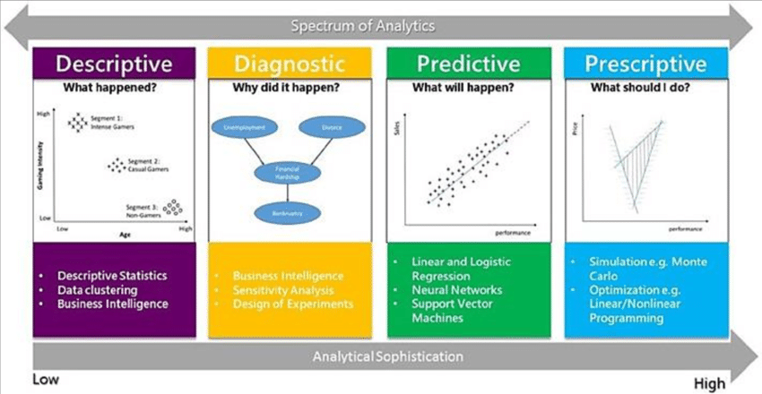

# 📊 Lesson 1: What is Data Analysis?

## Overview

**Duration**: 1 hour
**Date**: April 26, 2025
 

---

## 🎯 Learning Objectives

- Understand the fundamental definition of data analysis
- Recognize the critical role of data in modern decision-making
- Explore real-world applications of data analytics
- Identify how data analysis applies to various industries and everyday life

---

## 1. 🔍 Definition of Data Analysis

Data analysis is the process of inspecting, cleansing, transforming, and modeling data with the goal of discovering useful information, drawing conclusions, and supporting decision-making.

> "Data analysis is the process of bringing structure to data, identifying patterns, and extracting insights."

### Key Components:

| Component                        | Description                                                   |
| :------------------------------- | :------------------------------------------------------------ |
| **📥 Data Collection**     | Gathering relevant information from various sources           |
| **🧹 Data Cleaning**       | Removing errors, handling missing values, and formatting data |
| **⚙️ Data Processing**   | Transforming raw data into a usable format                    |
| **💡 Data Interpretation** | Drawing meaningful conclusions from patterns                  |
| **📈 Data Visualization**  | Presenting findings in an understandable format               |

---

## 2. 🌟 Importance of Data in Decision-Making

### Why Data Matters:

#### 🎯 Reduces Uncertainty

- Provides evidence-based grounds for decisions rather than relying on intuition alone

#### 💰 Identifies Opportunities

- Reveals patterns and trends that may not be immediately visible to the human eye

#### ⏱️ Improves Efficiency

- Helps target resources where they'll have the greatest impact on outcomes

#### 🔮 Enables Prediction

- Allows forecasting of future trends based on historical patterns and relationships

#### ✅ Validates Hypotheses

- Tests assumptions with objective measurements and statistical significance

**💼 Case Study**: A retail company that implemented data-driven inventory management reduced waste by 35% and increased profits by 15% within one year.

---

## 3. 🌏 Real-World Examples of Data-Driven Decisions

### Business Applications 🏢

#### 📈 Sales Forecasting

- Analyzing past sales data to predict future demand
- *Example: Amazon's anticipatory shipping system predicts what customers will buy before they order*

#### 📊 Market Trend Analysis

- Identifying emerging patterns in consumer behavior
- *Example: Netflix uses viewing data to decide which shows to produce*

#### 👥 Customer Segmentation

- Grouping customers based on behavior and preferences
- *Example: Target identifying pregnant customers through purchasing patterns*

### Healthcare Applications 🏥

#### 🏥 Patient Records Analysis

- Improving treatments based on historical outcomes
- *Example: Predictive models identifying patients at risk for readmission*

#### 🦠 Epidemic Tracking

- Monitoring disease spread patterns
- *Example: Contact tracing and hotspot identification during COVID-19*

#### ⚕️ Resource Allocation

- Optimizing staff schedules and medical supplies
- *Example: Hospital emergency department staffing based on historical admission patterns*

### Social Media Applications 📱

#### 👤 User Behavior Analysis

- Understanding engagement patterns
- *Example: TikTok's recommendation algorithm analyzing viewing time*

#### 😀 Sentiment Analysis

- Gauging public opinion on topics, brands, or events
- *Example: Companies monitoring Twitter reactions to product launches*

#### 🔗 Network Analysis

- Mapping relationships between users
- *Example: LinkedIn's "People You May Know" suggestions*

### Industry Data Applications

| Industry                        | Data Sources                                            | Key Analytics                                                    |
| ------------------------------- | ------------------------------------------------------- | ---------------------------------------------------------------- |
| **🛍️ Retail**           | Transaction data, Website behavior, Loyalty programs    | Basket analysis, Customer lifetime value, Inventory optimization |
| **🏥 Healthcare**         | Patient records, Treatment outcomes, Billing data       | Treatment efficacy, Readmission risk, Cost optimization          |
| **💰 Financial Services** | Transaction history, Market data, Customer profiles     | Fraud detection, Risk assessment, Investment performance         |
| **📱 Social Media**       | User interactions, Content engagement, Demographic data | Engagement metrics, Content recommendations, Ad targeting        |

---

## 4. 🔄 Brief Overview of Data Analytics Applications

### Types of Data Analytics:

#### 📜 Descriptive Analytics

- **Focus:** Understanding what happened
- **Question answered:** "What happened?"
- **Example:** Monthly sales reports, website traffic statistics
- **Tools:** Reports, dashboards, basic visualizations
- *"Our average sales decreased by 5% compared to last quarter."*

#### 🔍 Diagnostic Analytics

- **Focus:** Understanding why it happened
- **Question answered:** "Why did it happen?"
- **Example:** Analyzing why sales dropped in a particular region
- **Tools:** Drill-down analysis, correlation analysis, root cause exploration
- *"Sales decreased because our main competitor launched a discount campaign."*

#### 🔮 Predictive Analytics

- **Focus:** Forecasting what might happen
- **Question answered:** "What will be happen?"
- **Example:** Weather forecasts, stock market predictions
- **Tools:** Regression analysis, machine learning models, time series forecasting
- *"Based on current trends, we forecast a 12% sales increase next quarter."*

#### 🧭 Prescriptive Analytics

- **Focus:** Determining actions to take
- **Question answered:** "What should I do?"
- **Example:** Automated inventory ordering systems, personalized medicine
- **Tools:** Optimization algorithms, simulation, decision trees, AI
- *"To maximize profits next quarter, increase production of Product A by 15% and reduce marketing for Product B."*

### Emerging Fields:

#### 📊 Big Data Analytics

- Processing extremely large datasets that exceed the capabilities of traditional data processing software

#### 🔌 IoT Analytics

- Analyzing data streams from connected devices and sensors to optimize processes and experiences

#### 🧠 AI and Machine Learning

- Automating pattern recognition and enabling systems to learn from data without explicit programming

#### ⚖️ Data Ethics

- Addressing privacy, fairness, and responsible use concerns in data collection and analysis

### Analytics Maturity Scale

| Level | Type                   | Description         | Complexity   |
| ----- | ---------------------- | ------------------- | ------------ |
| 📜    | **Descriptive**  | What happened       | Basic        |
| 🔍    | **Diagnostic**   | Why it happened     | Intermediate |
| 🔮    | **Predictive**   | What might happen   | Advanced     |
| 🧭    | **Prescriptive** | What should be done | Expert       |

*Most organizations are at the descriptive/diagnostic stages and working toward predictive capabilities*

---

## 📝 Activity: Applying Data Analysis Concepts

### Group Discussion (20 minutes)

In groups of 3-4, identify and discuss:

#### 💬 Discussion Topics

1. **Personal Data Use**:

   - How do you use data to make decisions in your daily life?
   - What apps or services do you use that clearly employ data analysis?
2. **Professional Applications**:

   - Identify 3-5 ways data analysis is or could be applied in your industry or field of interest
   - What decisions in your workplace could benefit from better data analysis?
3. **Ethical Considerations**:

   - What privacy concerns arise from the data examples you've identified?
   - How can organizations balance data collection with user privacy?

#### ⏱️ Discussion Timeline

- **5m**: Personal Data Use examples
- **10m**: Professional Applications discussion
- **5m**: Ethical Considerations debate

### Reporting Back (10 minutes)

Each group will share their most interesting findings with the class.

---

## 📚 Additional Resources

### 📕 Recommended Reading

- **[&#34;Storytelling with Data&#34;](https://www.storytellingwithdata.com/)** by Cole Nussbaumer Knaflic*Learn how to effectively communicate insights through data visualization*
- **[&#34;Data Science for Business&#34;](https://data-science-for-biz.com/)** by Foster Provost & Tom Fawcett
  *Fundamental principles of data science and their business applications*

### 🔗 Online Resources

- **[Google&#39;s Data Analytics Professional Certificate](https://www.coursera.org/professional-certificates/google-data-analytics)***Comprehensive online course covering all aspects of data analysis*
- **[Khan Academy&#39;s Statistics and Probability](https://www.khanacademy.org/math/statistics-probability)***Free resources to understand the statistical foundations of data analysis*
- **[Tableau Public](https://public.tableau.com/en-us/s/gallery)**
  *Gallery of data visualizations for inspiration and learning*

---

## 📋 Homework

### ✍️ Assignment Tasks

**1️⃣ Find and analyze an example of data-driven decision making in the news**

- Identify the data sources used, how the data was analyzed, and the outcomes of the decision

**2️⃣ Write a brief reflection (1-2 paragraphs) on how data analysis could improve a process you're familiar with**

- Consider what data would be needed, how it would be collected, and what insights it might reveal

### 💪 Challenge Exercise (Optional)

Find a public dataset that interests you on [data.gov](https://data.gov) or [Kaggle](https://kaggle.com/datasets). Write three questions that could be answered with this data and explain why these questions would be valuable to investigate.

**Tip:** Look for datasets related to your field of interest or a current social issue you care about. This will make the exercise more engaging and relevant to your goals.
---

*Next Lesson: Data Collection and Preparation Techniques* ⏭️

**✓ Lesson 1 Complete - 1 of 6 ✓**
