# 📊 Lesson 2: Data Collection and Preparation Techniques

## Overview

**Duration**: 1 hour
**Date**: May 3, 2025
 

---

## 🎯 Learning Objectives

- Differentiate between qualitative and quantitative data
- Understand structured and unstructured data formats
- Identify appropriate sources of data for different analysis needs
- Recognize the importance of data quality, ethics, and privacy compliance

---

## 1. 📊 Qualitative vs. Quantitative Data

| Quantitative Data                                                                               | Qualitative Data                                                                                            |
| ----------------------------------------------------------------------------------------------- | ----------------------------------------------------------------------------------------------------------- |
| **📏 Definition:** Information that can be counted, measured, and expressed using numbers | **📝 Definition:** Describes qualities or characteristics that cannot be easily measured with numbers |
| **🔢 Answers questions like:** "How much," "how many," or "how often"                     | **❓ Answers questions like:** "why," "how," or "what"                                                |

```mermaid
---
id: 08146799-4a02-4f45-8e3f-b8abade20b61
---
flowchart TD
    A[Data] --> B[Quantitative Data]
    A --> C[Qualitative Data]

    B --> D[Discrete]
    B --> E[Continuous]

    C --> F[Nominal]
    C --> G[Ordinal]

    %% Explanations for Quantitative Data
    D --> D1["• Examples: Number of students,
      children, products sold"]

    E --> E1["• Examples: Height, weight,
      temperature, time"]

    %% Explanations for Qualitative Data
    F --> F1["• Examples: Blood types, eye colors,
      nationalities, product categories"]

    G --> G1["• Examples: Education levels,
      satisfaction ratings, size rankings"]

    %% Styling for dark mode
    classDef title fill:#6c5ce7,stroke:#fff,stroke-width:2px,color:#fff
    classDef quant fill:#0984e3,stroke:#dfe6e9,stroke-width:1px,color:#fff
    classDef qual fill:#00b894,stroke:#dfe6e9,stroke-width:1px,color:#fff
    classDef subtype fill:#636e72,stroke:#dfe6e9,stroke-width:1px,color:#fff
    classDef desc fill:#fdcb6e,stroke:#2d3436,stroke-width:1px,color:#2d3436,font-size:12px

    class A title
    class B,B1 quant
    class C,C1 qual
    class D,E,F,G subtype
    class D1,E1,F1,G1 desc
```



### Quantitative Data

**Key Characteristics:**

- 🔢 Numerical in nature
- 📈 Can be used for statistical analysis
- 📐 Objective measurement
- 🧮 Mathematical operations can be performed on it

**Examples:**

- Age: 25 years
- Temperature: 72°F
- Income: $65,000/year
- Time: 45 minutes
- Score: 85/100

**Real-world data examples:**
```
Store sales data:
Daily sales: $24,356
Items sold: 872 units
Average transaction value: $27.93
Customer conversion rate: 8.2%

Health metrics:
Weight: 68.4 kg
Heart rate: 72 bpm
Cholesterol: 185 mg/dL
Blood pressure: 120/80 mmHg
```

#### Subtypes of Quantitative Data

**📊 Discrete Data**

- Whole numbers/countable values
- Finite number of possible values
- Cannot be divided into smaller parts
- *Examples:* Number of students, children, cars

**Real-world data examples:**
```
Inventory counts:
Product A: 347 units in stock
Product B: 129 units in stock
Product C: 0 units in stock (out of stock)

Customer service:
Number of support tickets: 127
Calls handled per representative: 24, 31, 18, 27, 22
Reviews submitted: 5★ (43), 4★ (56), 3★ (22), 2★ (8), 1★ (5)
```

**📈 Continuous Data**

- Can take any value within a range
- Infinite number of possible values
- Can be divided into smaller parts
- *Examples:* Height, weight, temperature

**Real-world data examples:**
```
Environmental monitoring:
Temperature: 27.4°C
Humidity: 58.3%
Wind speed: 12.7 km/h
Particulate matter (PM2.5): 18.2 μg/m³

Manufacturing quality control:
Product weight: 254.32 grams
Dimensions: 15.76 cm x 8.23 cm x 1.04 cm
Resistance: 4.87 ohms
Failure load: 1,234.56 Newtons
```

### Qualitative Data

**Key Characteristics:**

- 📝 Descriptive rather than numerical
- 💬 Focuses on experiences, opinions, and attributes
- 🧠 Often subjective
- 🔍 Rich and detailed information

**Examples:**

- Gender: Male, Female
- Color preference: Blue
- Product feedback: "The interface is confusing"
- Mood: Happy, Sad, Anxious
- Category: Vegetable, Fruit, Grain

**Real-world data examples:**
```
Customer feedback:
"Your customer service team was extremely helpful and solved my issue right away."
"The product quality has declined over the past year. I'm considering switching brands."
"Website navigation is confusing, took me too long to find what I was looking for."

Product attributes:
Material: Cotton, Polyester, Wool, Silk, Linen
Sizes available: XS, S, M, L, XL, XXL
Color options: Navy Blue, Forest Green, Burgundy, Charcoal Grey
```

#### Subtypes of Qualitative Data

**🏷️ Nominal Data**

- Categories with no inherent order
- Cannot be ranked or compared meaningfully
- *Examples:* Blood types, eye colors, nationalities

**Real-world data examples:**
```
Employee records:
Department: Marketing, Engineering, Finance, Human Resources, Sales
Office location: Cairo, Alexandria, Aswan, Luxor, Hurghada
Employment type: Full-time, Part-time, Contractor, Intern

Product categorization:
Device type: Smartphone, Tablet, Laptop, Desktop, Wearable
Operating system: iOS, Android, Windows, Linux, macOS
Connectivity: Bluetooth, Wi-Fi, Cellular, Ethernet, NFC
```

**📋 Ordinal Data**

- Categories with a meaningful order/rank
- Differences between values may not be consistent
- *Examples:* Rating scales, education levels, rankings

**Real-world data examples:**
```
Customer satisfaction:
Very satisfied (234 responses)
Satisfied (412 responses)
Neutral (158 responses)
Dissatisfied (87 responses)
Very dissatisfied (29 responses)

Education levels of survey respondents:
High school diploma (142)
Associate's degree (78)
Bachelor's degree (215)
Master's degree (124)
Doctoral degree (41)
```

> "Both data types are valuable, and many robust analyses combine qualitative and quantitative approaches."

---

## 2. 🗂️ Structured vs. Unstructured Data


### Structured Data

Structured data is organized in a predefined format, making it easily searchable and analyzable.

#### 📋 Key Characteristics:

- Follows a strict, predefined model
- Organized in rows and columns
- Easy to search and analyze with standard tools
- Typically stored in relational databases

**Examples:**

- Excel spreadsheets
- SQL databases
- CSV files
- Survey results with fixed responses
- Financial records

**Real-world data examples:**
```
Customer database entry:
ID: 10458
Name: Ahmed Hassan
Email: ahmed.h@example.com
Age: 34
Registration Date: 2024-11-12
Subscription Type: Premium
Monthly Spend: $29.99

Sales transaction table:
TransactionID | Date       | ProductID | Quantity | UnitPrice | CustomerID
-----------------------------------------------------------------------------
T-45892      | 2025-04-22 | PRD-112   | 3        | $24.99    | 10458
T-45893      | 2025-04-22 | PRD-087   | 1        | $49.99    | 10458
T-45894      | 2025-04-22 | PRD-254   | 2        | $12.50    | 10782
```

### Unstructured Data

Unstructured data lacks a predefined data model and doesn't fit neatly into traditional databases.

#### 🌐 Key Characteristics:

- No predefined organization or format
- Difficult to search with conventional tools
- Requires specialized processing techniques
- Contains rich and complex information

**Examples:**

- Email messages
- Social media posts
- Video and audio recordings
- Images and photographs
- Open-ended survey responses

**Real-world data examples:**
```
Social media post:
"Just experienced the most amazing customer service at @TechCompany! The representative spent 45 minutes helping me troubleshoot my device issues and even followed up the next day to make sure everything was working properly! #CustomerServiceWin #HappyCustomer"

Customer support email:
Subject: Issues with recent order #45892
Body: "Hello, I ordered three t-shirts on April 22nd but received only two. The missing shirt is the blue one in size medium. Could you please look into this? Also, the packaging was damaged upon arrival. I've attached photos of the box. Thanks for your help."
```

### Semi-Structured Data

A hybrid category that contains elements of both structured and unstructured data.

#### 🔄 Key Characteristics:

- Has some organizational properties but doesn't conform to strict formats
- Contains tags or markers that separate elements
- More flexible than structured data but more organized than unstructured

**Examples:**

- JSON files
- XML documents
- HTML webpages
- Email headers combined with message body

**Real-world data examples:**
```
JSON product data:
{
  "product_id": "PRD-112",
  "name": "Premium Cotton T-Shirt",
  "price": 24.99,
  "available_colors": ["Black", "White", "Navy", "Red"],
  "available_sizes": ["S", "M", "L", "XL"],
  "specs": {
    "material": "100% Organic Cotton",
    "weight": "180g",
    "care": "Machine wash cold"
  },
  "reviews": [
    {
      "user_id": "U10458",
      "rating": 5,
      "comment": "Great quality and fits perfectly!"
    },
    {
      "user_id": "U10782",
      "rating": 4,
      "comment": "Nice shirt but runs a bit small"
    }
  ]
}

XML weather data:
<weather location="Cairo" date="2025-05-03">
  <temperature unit="celsius">28.4</temperature>
  <humidity unit="percent">52</humidity>
  <wind>
    <speed unit="kph">12</speed>
    <direction>NE</direction>
  </wind>
  <forecast>
    <day date="2025-05-04">
      <high>30.2</high>
      <low>22.1</low>
      <conditions>Mostly sunny</conditions>
    </day>
    <day date="2025-05-05">
      <high>31.5</high>
      <low>23.0</low>
      <conditions>Partly cloudy</conditions>
    </day>
  </forecast>
</weather>
```

---

## 3. 📂 Sources of Data

| Primary Sources             | Secondary Sources         |
| --------------------------- | ------------------------- |
| Surveys and questionnaires  | Public databases          |
| Interviews and focus groups | Government reports        |
| Direct observations         | Academic publications     |
| Experiments                 | Industry reports          |
| Field research              | Web and social media data |

### Primary Data Sources

Primary data is collected directly by the researcher for a specific purpose.

#### ✅ Advantages

- Collected for the specific research question
- Researcher has full control over collection methods
- Known quality and reliability
- Proprietary information advantage

#### ⚠️ Disadvantages

- Time-consuming and expensive to collect
- Requires expertise in research design
- Limited sample size possible
- May introduce researcher bias

#### Common Primary Data Collection Methods:

**📝 Surveys and Questionnaires**

- Online surveys (e.g., Google Forms, SurveyMonkey)
- Paper surveys
- Email questionnaires
- Mobile polling

**Real-world data examples:**
```
Q: "How satisfied are you with our service?"
A: Very satisfied (5), Satisfied (4), Neutral (3), Dissatisfied (2), Very dissatisfied (1)

Q: "How many times did you visit our store this month?"
A: 0, 1-2, 3-5, 6+ times

Q: "What features would you like to see in our next product update?"
A: [Open text response] "I would like to see better integration with mobile devices..."
```

**🎙️ Interviews**

- Structured interviews (predetermined questions)
- Semi-structured interviews (guided but flexible)
- Unstructured interviews (conversational)
- Focus groups (group discussions)

**Real-world data examples:**
```
Interview transcript excerpt:
Interviewer: "Could you describe your experience with our checkout process?"
Participant: "It was mostly smooth, but I got confused when I had to verify my email before completing my purchase."

Focus group comment:
"I prefer shopping online because I can compare prices across multiple sites. Last week, I spent 45 minutes comparing laptop prices before making a purchase."
```

**👁️ Observations**

- Direct observation (watching behavior)
- Participant observation (immersion in setting)
- Field research (natural environment)
- Laboratory observations (controlled environment)

**Real-world data examples:**
```
Retail store observation:
Time: 2:15 PM | Customer count: 27 | Queue length: 4 people | Average browsing time: 8.5 minutes
Customer path tracking: Entered → Electronics (5 min) → Accessories (3 min) → Checkout (2 min)

Website user observation:
User spent 45 seconds on homepage → clicked "Products" → filtered by "Price low to high" → added item to cart after 3 minutes → abandoned cart at shipping information page
```

**🧪 Experiments**

- Controlled experiments (manipulating variables)
- Field experiments (real-world settings)
- A/B testing (comparing variations)

**Real-world data examples:**
```
A/B testing results:
Version A (blue button): 1,500 visitors, 120 conversions (8.0% conversion rate)
Version B (green button): 1,500 visitors, 195 conversions (13.0% conversion rate)

Clinical trial data:
Treatment group: Average blood pressure reduction of 12 mmHg over 8 weeks (n=85)
Control group: Average blood pressure reduction of 3 mmHg over 8 weeks (n=82)
```

### Secondary Data Sources

Secondary data is collected by someone else for a different primary purpose.

#### ✅ Advantages

- Time and cost-efficient
- Often larger sample sizes
- May cover longer time periods
- No data collection burden

#### ⚠️ Disadvantages

- Not tailored to specific research needs
- May be outdated
- Unknown quality or collection methods
- Potential accessibility or licensing issues

#### Common Secondary Data Sources:

**🏛️ Public Records and Government Data**

- Census data
- Economic indicators
- Health statistics
- Weather data
- Crime statistics

**Real-world data examples:**
```
Census data:
Population by age group (Cairo, 2020):
0-14 years: 27.8% (5.2 million)
15-24 years: 19.2% (3.6 million)
25-54 years: 43.1% (8.1 million)
55-64 years: 5.9% (1.1 million)
65+ years: 4.0% (0.75 million)

Economic indicators:
GDP Growth Rate: 3.6% (Q1 2025)
Unemployment Rate: 5.2% (April 2025)
Consumer Price Index: 128.4 (base year 2015=100)
```

**💼 Commercial and Business Sources**

- Industry reports
- Market research
- Financial databases
- Company annual reports

**Real-world data examples:**
```
Market research report excerpt:
Smartphone Market Share (Q1 2025):
Brand A: 32.4%
Brand B: 29.7%
Brand C: 15.3%
Brand D: 8.9%
Others: 13.7%

Financial performance data:
Company XYZ Annual Revenue (millions USD):
2022: $458.3
2023: $512.7
2024: $587.9
2025 (projected): $650.2
```

**🎓 Academic and Research Resources**

- Academic journals
- Research publications
- University repositories
- Case studies

**Real-world data examples:**
```
Research study results:
Effect of Exercise on Stress Levels (n=234)
Group 1 (control): Average stress score 7.2/10
Group 2 (20 min/day): Average stress score 5.1/10
Group 3 (40 min/day): Average stress score 3.9/10
p-value: 0.002

Educational statistics:
University Graduation Rates by Field of Study:
Computer Science: 76.2%
Business: 82.5%
Engineering: 74.8%
Humanities: 79.3%
```

**🌐 Web and Digital Sources**

- Social media data
- Website analytics
- Online databases
- Digital archives
- API access to platforms

**Real-world data examples:**
```
Website analytics:
Daily Traffic: 28,452 visitors
Bounce Rate: 42.3%
Average Session Duration: 3:24 minutes
Top Traffic Sources: Organic Search (52%), Social Media (28%), Direct (15%)

Social media data:
Hashtag #DataScience mentions: 3,820 (last 24 hours)
Sentiment analysis: Positive (62%), Neutral (25%), Negative (13%)
Peak posting times: 9-10am and 7-8pm local time
```

---

## 4. 🛡️ Data Quality and Ethics

### Data Quality Dimensions

#### ✓ Accuracy

- Correctness of the data
- Free from errors and reliable
- Verified against trusted sources

#### ☑ Completeness

- All required data is present
- No essential information missing
- Adequate population coverage

#### 🔄 Consistency

- Data values don't contradict each other
- Uniform formatting across similar data
- Logical coherence within the dataset

#### ⏱️ Timeliness

- Data is up-to-date
- Available when needed
- Relevant to the current situation

#### 🎯 Relevance

- Applicable to the analysis objectives
- Adds value to decision-making
- Addresses the research question

### Data Ethics and Privacy

#### 🔑 Key Ethical Considerations

**🤝 Informed Consent**

- Participants understand how their data will be used
- Clear explanation of data collection purpose
- Option to withdraw consent

**🔒 Privacy Protection**

- Anonymization of personal information
- Secure data storage and transmission
- Limited access to sensitive information

**📄 Data Ownership**

- Clear policies on who owns collected data
- Transparency about data sharing practices
- Respecting intellectual property rights

#### ⚖️ Compliance Frameworks

**🇪🇺 GDPR (General Data Protection Regulation)**

- European Union's comprehensive data protection law
- Rights for individuals to access and control their data
- Requirements for data breach notifications

**🇺🇸 CCPA (California Consumer Privacy Act)**

- California's privacy legislation
- Consumer rights regarding personal information
- Opt-out options for data sales

**⚕️ HIPAA (Health Insurance Portability and Accountability Act)**

- U.S. protection for medical information
- Security requirements for health data
- Patient rights to their health records

> "Always implement privacy by design - building privacy considerations into data collection systems from the beginning rather than adding them later."

---

## 📝 Activity: Classifying Data Types

### Group Exercise (20 minutes)

#### 💬 Instructions

1. Form groups of 3-4
2. For each example below, classify the data as:
   - Qualitative or Quantitative
   - If Quantitative: Discrete or Continuous
   - If Qualitative: Nominal or Ordinal
   - Structured or Unstructured
3. Identify a potential primary and secondary source for each type of data

#### Examples to Classify:

1. Customer satisfaction ratings (1-5 stars)
2. Employee email communications
3. Annual revenue figures for a company
4. Blood pressure readings
5. Social media comments about a product
6. Zip/postal codes
7. College degrees (Bachelor's, Master's, PhD)
8. Time to complete a marathon
9. Security camera footage
10. Product categories in an e-commerce store

### Discussion (10 minutes)

- Share your classifications with the class
- Discuss any examples where groups disagreed
- Consider how the data type influences how you would collect and analyze it


---

## 📚 Additional Resources

### 📕 Recommended Reading

- **[&#34;Data Science from Scratch&#34;](https://www.oreilly.com/library/view/data-science-from/9781492041122/)** by Joel Grus
  *Learn practical approaches to data collection and analysis from the ground up*
- **[&#34;Practical Statistics for Data Scientists&#34;](https://www.oreilly.com/library/view/practical-statistics-for/9781491952955/)** by Peter Bruce & Andrew Bruce
  *Essential statistical methods and their applications in data science*

### 🔗 Online Resources

- **[Types of Data in Statistics](https://www.khanacademy.org/math/statistics-probability/designing-studies/types-of-studies/v/types-of-data)** - Khan Academy
  *Free tutorials on data types and statistical foundations*
- **[Data Ethics Framework](https://www.gov.uk/government/publications/data-ethics-framework)** - UK Government
  *Guidance on ethical approaches to data collection and analysis*
- **[GDPR Official Documentation](https://gdpr.eu/)**
  *Complete guide to European data protection regulations*

---

## 📋 Homework

### ✍️ Assignment Tasks

**1️⃣ Find three real-world datasets - one primarily quantitative, one primarily qualitative, and one that contains both types of data**

- For each dataset, identify the source type, structure, and any potential ethical considerations

**2️⃣ For each dataset, document:**

- The source (primary or secondary)
- The structure (structured, semi-structured, or unstructured)
- Any potential ethical considerations when using this data

### 💪 Challenge Exercise (Optional)

Select a business or organization you're familiar with and create a data inventory. List 5-10 types of data they likely collect, and classify each according to the categories we've discussed today. For each data type, briefly note any ethical or privacy considerations that should be addressed.

**Tip:** Consider starting with obvious data types like customer information, then think about less obvious data such as website analytics or employee performance metrics.

---

*Next Lesson: The Data Analysis Lifecycle* ⏭️

**✓ Lesson 2 Complete - 2 of 6 ✓**
