# 📊 Lesson 3: The Data Analysis Lifecycle

## Overview

**Duration**: 1 hour
**Date**: May 10, 2025
 

---

## 🎯 Learning Objectives

- Understand the complete lifecycle of a data analysis project
- Identify the key activities and deliverables for each stage
- Recognize appropriate tools for different stages of analysis
- Apply the data analysis lifecycle to a practical example

---

## 1. 🔄 Introduction to the Data Analysis Lifecycle

The data analysis lifecycle is a structured approach to turning raw data into actionable insights. Each stage builds upon the previous one, creating a framework that ensures thoroughness, accuracy, and relevance in data-driven decision making.

> "Good data analysis tells a story that answers the original question clearly and compellingly."

---

## 2. 🛠️ Stages of Data Analysis

| Stage                            | Focus                                            |
| -------------------------------- | ------------------------------------------------ |
| **Data Collection**  📥    | Gathering relevant data from appropriate sources |
| **Data Cleaning**  🧹      | Transforming raw data into usable format         |
| **Data Exploration**  🔍   | Examining data to identify patterns and insights |
| **Data Visualization**  📊 | Translating findings into visual formats         |
| **Communication**  📢      | Sharing insights with stakeholders               |
| **Decision-Making**  ⚙️  | Applying insights to business actions            |

### Stage 1: Data Collection 📥

**🎯 Purpose**: Gather relevant data from appropriate sources to address the research question or business need.

#### 🔑 Key Activities:

- Define clear objectives and questions to be answered
- Identify potential data sources (internal systems, external providers, etc.)
- Determine collection methods (APIs, databases, surveys, etc.)
- Create a data collection plan with timelines
- Establish data governance standards for the project

#### 📦 Deliverables:

- Raw dataset(s)
- Data collection methodology documentation
- Initial data catalog or inventory

#### ⚠️ Challenges:

- Ensuring data relevance to the research question
- Accessing and extracting data from various systems
- Handling permissions and privacy concerns
- Managing large volumes of data

> **Best Practice**: Begin with a clear question or objective. The quality of your analysis can only be as good as the clarity of your original question.

### Stage 2: Data Cleaning and Preparation 🧹

**🎯 Purpose**: Transform raw data into a clean, consistent, and usable format for analysis.

#### 🔑 Key Activities:

- Remove duplicate entries
- Handle missing values (deletion, imputation, etc.)
- Correct errors and inconsistencies
- Standardize formats and units
- Normalize or scale numerical variables
- Encode categorical variables
- Create derived variables as needed

#### 📦 Deliverables:

- Cleaned dataset
- Data dictionary explaining variables
- Documentation of cleaning steps and decisions
- Validation report showing data quality metrics

#### ⚠️ Challenges:

- Identifying anomalies without domain knowledge
- Making appropriate decisions about missing data
- Maintaining data integrity during transformations
- Balancing automation with manual review

> **Best Practice**: Document every cleaning decision made. This creates transparency and allows others to validate your approach or repeat your process.

### Stage 3: Data Exploration and Analysis 🔍

**🎯 Purpose**: Examine the data to identify patterns, relationships, and insights that address the research question.

#### 🔑 Key Activities:

- Calculate descriptive statistics (mean, median, etc.)
- Identify correlations and relationships between variables
- Apply statistical tests and models
- Segment data into meaningful groups
- Test hypotheses derived from business questions
- Iterate through various analytical approaches

#### 📦 Deliverables:

- Exploratory data analysis (EDA) report
- Statistical summaries and test results
- Analytical models with performance metrics
- Key findings and initial insights

#### ⚠️ Challenges:

- Avoiding confirmation bias in analysis
- Selecting appropriate analytical methods
- Distinguishing correlation from causation
- Managing computational limitations with large datasets

> **Best Practice**: Begin with simple analyses before moving to complex models. Understanding the basic characteristics of your data will guide more sophisticated approaches.

### Stage 4: Data Visualization 📊

**🎯 Purpose**: Translate complex findings into visual formats that clearly communicate insights.

#### 🔑 Key Activities:

- Select appropriate visualization types for different data
- Create clear, accurate, and meaningful visualizations
- Design dashboards for interactive exploration
- Refine visuals based on audience feedback
- Ensure visualizations are accessible and inclusive

#### 📦 Deliverables:

- Static visualizations (charts, graphs, etc.)
- Interactive dashboards
- Infographics or visual summaries
- Technical documentation of visualization methods

#### ⚠️ Challenges:

- Choosing the right visualization for the data type
- Avoiding misleading representations
- Balancing simplicity with information density
- Creating visualizations accessible to all users

> **Best Practice**: Design visualizations with the audience in mind. Technical audiences may need different visualizations than executive stakeholders.

#### 🎨 Types of Visualizations and Their Use Cases

**Comparison Visualizations**

*Bar Charts*

**Best for**: Comparing values across categories
**Data type**: Categorical with numeric values

**Example use cases**:

- Sales by product category
- Survey responses by demographic group
- Performance metrics across departments

---

*Grouped Bar Charts*

**Best for**: Comparing values across categories with subcategories
**Data type**: Categorical with multiple numeric variables

**Example use cases**:

- Sales by region and product category
- Expenses by department across quarters
- Test scores by school and subject

---

*Radar/Spider Charts*

**Best for**: Comparing multiple variables across entities
**Data type**: Multiple metrics for comparison

**Example use cases**:

- Performance evaluations across multiple dimensions
- Product features comparison
- Skills assessment profiles

---

**Time Series Visualizations**

*Line Charts*

**Best for**: Showing trends over time
**Data type**: Time series

**Example use cases**:

- Stock price changes over time
- Monthly website traffic trends
- Temperature fluctuations through seasons

---

*Area Charts*

**Best for**: Showing volume over time
**Data type**: Time series with emphasis on magnitude

**Example use cases**:

- Market share evolution over time
- Cumulative project progress
- Website traffic sources over time

---

### Candlestick Charts

  
  
<em>Example of a candlestick chart showing price movements over time</em>

**Best for**: Showing price movement with open/close/high/low values  
**Data type**: Time series with range data

**Example use cases**:
- Stock or cryptocurrency price movements
- Trading data analysis
- Price volatility patterns

---

### Distribution Visualizations

#### Histograms

  
  
<em>Example of a histogram showing frequency distribution</em>

**Best for**: Showing distribution of a single variable  
**Data type**: Continuous numeric data

**Example use cases**:
- Age distribution of customers
- Test score distributions
- Response time frequencies

---

#### Box Plots

  
  
<em>Example of box plots showing data distribution with quartiles</em>

**Best for**: Showing data distribution with quartiles and outliers  
**Data type**: Numeric data with statistical spread

**Example use cases**:
- Salary distributions by department
- Product performance variability
- Comparing data spread across groups

---

*Violin Plots*

**Best for**: Showing density distribution and statistical summary
**Data type**: Continuous data with multiple distributions

**Example use cases**:

- Comparing distributions across categories
- Analyzing bimodal data patterns
- Customer rating distributions by product

---

**Relationship Visualizations**

#### Scatter Plots

  
  
<em>Example of a scatter plot showing relationship between two variables</em>

**Best for**: Showing relationship between two variables  
**Data type**: Two numeric variables

**Example use cases**:
- Price vs. quality correlation
- Height vs. weight relationships
- Marketing spend vs. sales relationship

---

#### Bubble Charts

  
  
<em>Example of a bubble chart showing relationships with three variables</em>

**Best for**: Showing relationship between three variables  
**Data type**: Two numeric variables plus a third for bubble size

**Example use cases**:
- GDP per capita vs. life expectancy with population size
- Product features vs. price with sales volume
- Marketing channels by cost and conversion rate

---

#### Heatmaps

  
  
<em>Example of a heatmap showing patterns across two categorical dimensions</em>

**Best for**: Showing patterns across two categorical dimensions  
**Data type**: Matrix of values in two dimensions

**Example use cases**:
- Website activity by hour and day of week
- Correlation matrix between variables
- Performance metrics across regions and products

---

**Composition Visualizations**

#### Pie Charts

  
  
<em>Example of a pie chart showing parts of a whole</em>

**Best for**: Showing parts of a whole (limited to 5-7 categories)  
**Data type**: Categorical data as percentages of total

**Example use cases**:
- Market share distribution
- Budget allocation by department
- Traffic sources to a website

---

#### Stacked Bar Charts

  
  
<em>Example of a stacked bar chart showing composition across categories</em>

**Best for**: Showing composition and total values across categories  
**Data type**: Categorical with subcategories and values

**Example use cases**:
- Revenue breakdown by product and region
- Population demographics over time
- Survey responses across multiple questions

---

#### Treemaps

  
  
<em>Example of a treemap showing hierarchical data structure</em>

**Best for**: Hierarchical data with nested categories  
**Data type**: Hierarchical categorical data with values

**Example use cases**:
- File system storage allocation
- Product categories and subcategories by sales
- Organizational structure with performance metrics

---

**Spatial Visualizations**

#### Choropleth Maps

  
  
<em>Example of a choropleth map showing values across geographic regions</em>

**Best for**: Showing values across geographic areas  
**Data type**: Geographic data with associated values

**Example use cases**:
- Population density by region
- Sales performance across territories
- Election results by district

---

#### Point Maps

  
  
<em>Example of a point map showing individual locations</em>

**Best for**: Showing individual locations  
**Data type**: Geographic coordinates with attributes

**Example use cases**:
- Store locations with performance data
- Customer distribution in a region
- Event locations with attendance figures

---

#### Flow Maps

  
  
<em>Example of a flow map showing movement between locations</em>

**Best for**: Showing movement between locations  
**Data type**: Origin-destination pairs with volumes

**Example use cases**:
- Migration patterns between countries
- Supply chain and logistics flows
- Customer movement between store locations

---

**Specialized Visualizations**

#### Network Graphs

  
  
<em>Example of a network graph showing relationships between entities</em>

**Best for**: Showing relationships and connections between entities  
**Data type**: Node-link data with relationships

**Example use cases**:
- Social network analysis
- Organization connections and hierarchies
- Product recommendation systems

---

#### Sankey Diagrams

  
  
<em>Example of a Sankey diagram showing flow quantities between stages</em>

**Best for**: Showing flow quantities between categories or stages  
**Data type**: Flow data between nodes

**Example use cases**:
- Website user flow analysis
- Energy transfer diagrams
- Budget flow between departments

---

#### Funnel Charts

  
  
<em>Example of a funnel chart showing sequential process stages</em>

**Best for**: Showing sequential process and drop-offs  
**Data type**: Sequential steps with decreasing values

**Example use cases**:
- Sales conversion funnel
- Recruitment process stages
- Customer journey analysis

---

## 3. 📢 Communication of Insights

**🎯 Purpose**: Share insights with stakeholders in a clear and actionable manner.

#### 🔑 Key Activities:

- Identify the primary audience and their needs
- Structure insights in a logical narrative flow
- Choose appropriate formats (reports, dashboards, presentations)
- Translate technical findings into business language
- Prepare for questions and follow-up analyses

#### 📦 Deliverables:

- Executive summaries for leadership
- Detailed technical reports for specialists
- Interactive dashboards for ongoing monitoring
- Presentation materials for meetings
- Documentation of analytical methods

#### ⚠️ Challenges:

- Balancing technical accuracy with accessibility
- Avoiding information overload
- Addressing different stakeholder interests
- Communicating uncertainty and limitations
- Ensuring insights lead to action

> **Best Practice**: Structure communications with the "Pyramid Principle" - start with the main insight, then provide supporting evidence, and finally detailed analysis for those who want to dig deeper.

### Stage 6: Decision-Making and Implementation ⚙️

**🎯 Purpose**: Apply insights to business actions and measure outcomes.

#### 🔑 Key Activities:

- Translate insights into recommended actions
- Prioritize recommendations by impact and feasibility
- Develop implementation plans with stakeholders
- Monitor outcomes and adjust as needed
- Create feedback loops for continuous improvement

#### 📦 Deliverables:

- Prioritized recommendation list
- Implementation roadmap
- Success metrics and tracking systems
- Follow-up analysis plans
- Lessons learned documentation

#### ⚠️ Challenges:

- Overcoming resistance to data-driven changes
- Managing competing priorities
- Isolating the impact of implemented changes
- Maintaining momentum for ongoing initiatives
- Dealing with unexpected outcomes

> **Best Practice**: For each insight, explicitly define: What finding did we discover? Why does it matter to the business? What specific action should we take? How will we measure success?

---

## 4. 🔄 Iterative Nature of Data Analysis

Data analysis is rarely a strictly linear process. In practice, analysts often cycle through stages multiple times, refining their approach based on what they learn.

```mermaid
graph TD
    A[Define Question] -->|Start| B[Data Collection 📥]
    B --> C[Data Cleaning 🧹]
    C --> D[Data Exploration 🔍]
    D --> E[Data Visualization 📊]
    E --> F[Communication 📢]
    F --> G[Decision Making ⚙️]

    %% Discovery Loop
    D -->|New Questions| A

    %% Refinement Loop
    E -->|Need Better Data| C

    %% Validation Loop
    D -->|Verify Findings| B

    %% Scope Expansion
    G -->|New Insights| A

    style A fill:#ff9e64,stroke:#fff,stroke-width:2px,color:#fff
    style B fill:#7aa2f7,stroke:#fff,stroke-width:1px,color:#fff
    style C fill:#7dcfff,stroke:#fff,stroke-width:1px,color:#fff
    style D fill:#bb9af7,stroke:#fff,stroke-width:1px,color:#fff
    style E fill:#2ac3de,stroke:#fff,stroke-width:1px,color:#fff
    style F fill:#9ece6a,stroke:#fff,stroke-width:1px,color:#fff
    style G fill:#e0af68,stroke:#fff,stroke-width:1px,color:#fff

    linkStyle default stroke:#fff,stroke-width:1.5px
```

### Common Iteration Patterns

| Pattern | Description | Example |
|---------|-------------|---------|
| **Discovery Loop** 🔍 | New questions emerge during analysis | While analyzing customer churn, you discover seasonal patterns that prompt a new line of investigation |
| **Refinement Loop** 🔧 | Initial analysis needs improvement | After creating visualizations, you realize you need to clean outliers from your data |
| **Validation Loop** ✅ | Findings require confirmation | You discover an unexpected trend and need to validate it with additional data sources |
| **Scope Expansion** 🔄 | Analysis grows to include related areas | A product analysis expands to include competitive analysis and market trends |

> **Key Insight**: Successful analysts embrace this iterative nature rather than forcing a linear process. Being flexible and willing to revisit previous stages often leads to deeper insights.

---

## 📝 Activity: Visualization Selection Challenge

### Group Exercise (25 minutes)

#### Setup:
- Form groups of 3-4 students
- Each group will be assigned one of the following data scenarios

#### Data Scenarios:

1. **Retail Sales Analysis**
   - Monthly sales data across 5 product categories in 8 regions over 3 years
   - Customer demographic information (age, gender, income level)
   - Marketing campaign dates and budgets

2. **Healthcare Patient Outcomes**
   - Treatment results for 3 different therapies
   - Patient demographics and medical history
   - Cost and duration of treatments
   - Side effects and complications

3. **Website User Behavior**
   - Visit duration and bounce rates by page
   - Conversion funnel progression
   - User acquisition sources
   - Device and browser information

4. **Employee Performance Data**
   - Performance ratings across 6 departments
   - Tenure and promotion history
   - Training completion and skill assessments
   - Employee satisfaction scores

#### Task Instructions:

1. For your assigned scenario:
   - Identify 3 key questions the data could help answer
   - Select the most appropriate visualization type for each question
   - Sketch a rough example of each visualization
   - Explain why you chose these visualization types

2. Consider:
   - Who is the target audience for each visualization?
   - What story does each visualization tell?
   - How might these visualizations be combined in a dashboard?

#### Presentation (15 minutes):
- Each group will share their selections and reasoning
- Class discussion on alternative approaches

---

## 📚 Additional Resources

### Books on Data Visualization and Communication

- 📊 "Storytelling with Data" by Cole Nussbaumer Knaflic
- 📈 "Information Dashboard Design" by Stephen Few
- 📉 "The Visual Display of Quantitative Information" by Edward Tufte
- 📊 "Data Visualization: A Practical Introduction" by Kieran Healy

### Online Resources

- [Data Visualization Catalogue](https://datavizcatalogue.com/)
- [Tableau Public Gallery](https://public.tableau.com/gallery)
- [Information is Beautiful](https://informationisbeautiful.net/)
- [Flowing Data](https://flowingdata.com/)
- [Visualization Tools Comparison](https://www.tableau.com/learn/articles/data-visualization-tools)

### Tutorials and Courses

- [Google Data Studio Fundamentals](https://analytics.google.com/analytics/academy/course/10)
- [Tableau Free Training Videos](https://www.tableau.com/learn/training)
- [Power BI Learning Resources](https://powerbi.microsoft.com/en-us/learning/)
- [DataCamp Data Visualization Courses](https://www.datacamp.com/courses/topic:data_visualization)

### Visualization Communities

- [Data Visualization Society](https://www.datavisualizationsociety.com/)
- [Reddit r/dataisbeautiful](https://www.reddit.com/r/dataisbeautiful/)
- [Tableau Community Forums](https://community.tableau.com/)

---

## 📋 Homework Assignment

### Part 1: Data Analysis Lifecycle Application

Choose a public dataset from one of these sources:
- [Kaggle Datasets](https://www.kaggle.com/datasets)
- [Google Dataset Search](https://datasetsearch.research.google.com/)
- [UCI Machine Learning Repository](https://archive.ics.uci.edu/ml/index.php)

Complete the following tasks:

1. **Data Collection & Understanding**
   - Document the source of the dataset
   - Describe the data structure, variables, and their meanings
   - Identify potential research questions this data could answer

2. **Data Cleaning & Preparation**
   - Identify any quality issues in the data
   - Document 3-5 specific cleaning steps you would take
   - Explain your reasoning for each step

3. **Visualization Plan**
   - Select 3 different visualization types appropriate for your dataset
   - For each visualization:
     - Explain what question it would answer
     - Describe what variables would be included
     - Justify why this visualization type is appropriate
     - Sketch a rough mockup (hand-drawn is acceptable)

### Part 2: Visualization Critique

Find 3 examples of data visualizations in news articles, reports, or websites (screenshots or links).

For each visualization:
1. Describe what works well about the visualization
2. Identify one thing that could be improved
3. Suggest an alternative visualization approach if appropriate

### Submission Format

Prepare your homework as a document (Word, PDF, or Google Doc) with clear section headings. Include all sketches, screenshots, and references.

---

*Next Lesson: Roles and Responsibilities of a Data Analyst* ⏭️

**✓ Lesson 3 Complete - 3 of 6 ✓**
