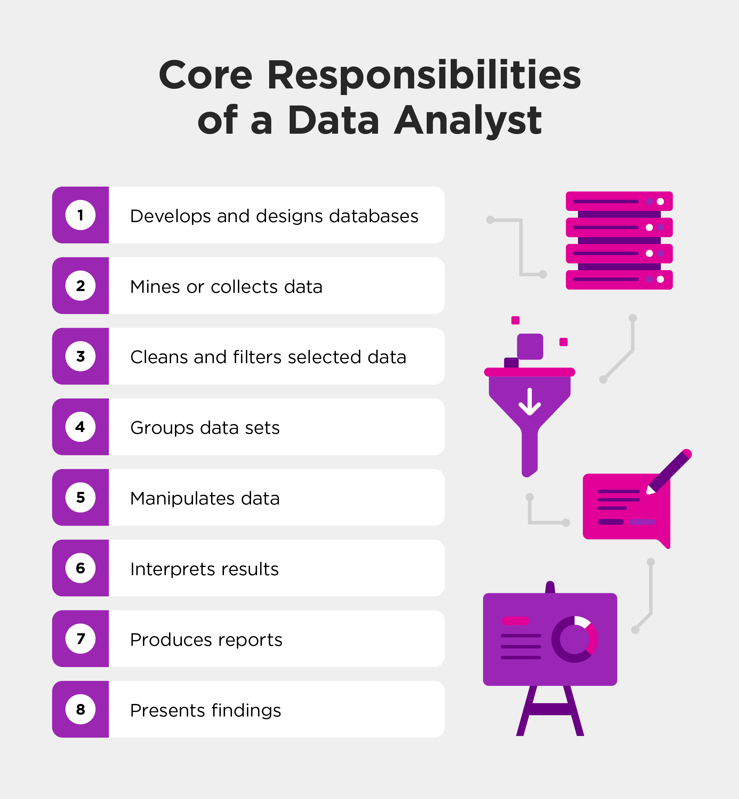

# 📊 Lesson 4: Roles and Responsibilities of a Data Analyst

## Overview

**Duration**: 1 hour
**Date**: May 17, 2025
 

---

## 🎯 Learning Objectives

- 🎯 Understand the core responsibilities of a data analyst
- 🔧 Identify key technical and soft skills required for success
- 🌐 Differentiate between data analyst and related roles
- 🛣️ Explore typical career progression paths

---

## 1. 👨‍💻 The Data Analyst Role: Definition and Scope

> **Definition:** A data analyst collects, processes, and performs statistical analyses on large datasets. They discover how data can be used to answer questions and solve problems, transforming raw data into meaningful insights for decision-making.



### Core Responsibilities

#### 📊 Data Processing

- Gathering data from primary and secondary sources
- Cleaning and reorganizing data for analysis
- Creating and maintaining databases/data systems

#### 📈 Analysis & Visualization

- Identifying patterns and trends in complex datasets
- Creating visual representations of data
- Developing and maintaining dashboards

#### 📝 Reporting & Communication

- Translating data into actionable insights
- Preparing reports for technical and non-technical audiences
- Collaborating with stakeholders across departments

#### 🔄 Process Improvement

- Automating repetitive analysis tasks
- Identifying opportunities for data quality improvement
- Supporting data governance initiatives

### A Day in the Life of a Data Analyst

| Time     | Activity                               | Description                                                             |
| -------- | -------------------------------------- | ----------------------------------------------------------------------- |
| 9:00 AM  | 🔄**Daily Stand-up**             | Review priorities with team, address any blockers                       |
| 9:30 AM  | 📥**Data Collection & Cleaning** | Pull latest data sets, handle missing values, clean inconsistencies     |
| 11:00 AM | 🔍**Analysis**                   | Run statistical tests, identify trends, create analytical models        |
| 1:00 PM  | 📊**Visualization**              | Create charts, graphs, and dashboards to represent findings             |
| 2:30 PM  | 👥**Stakeholder Meeting**        | Present findings to business team, gather requirements for new analyses |
| 3:30 PM  | 📝**Documentation**              | Update analysis documentation, annotate code, record methodologies      |
| 4:30 PM  | 📚**Learning**                   | Stay up-to-date with new tools, techniques, and industry trends         |

> 💡 **Reality Check**: The day-to-day activities can vary significantly depending on company size, industry focus, and specific role. Some analysts spend more time on reporting, while others focus more on exploratory analysis or dashboard development.

---

## 2. 🛠️ Essential Skills for Data Analysts

### Technical Skills vs. Soft Skills

#### 🔧 Technical Skills

| Skill Category                                          | Importance |
| ------------------------------------------------------- | ---------- |
| **SQL & Database Knowledge**                      | ⭐⭐⭐⭐⭐ |
| **Spreadsheet Proficiency (Excel/Google Sheets)** | ⭐⭐⭐⭐⭐ |
| **Statistical Analysis**                          | ⭐⭐⭐⭐   |
| **Data Visualization**                            | ⭐⭐⭐⭐   |
| **Programming (Python/R)**                        | ⭐⭐⭐     |
| **Business Intelligence Tools**                   | ⭐⭐⭐     |
| **Data Cleaning & Preparation**                   | ⭐⭐⭐⭐⭐ |

#### 🤝 Soft Skills

| Skill Category                                | Importance |
| --------------------------------------------- | ---------- |
| **Communication (Written & Verbal)**    | ⭐⭐⭐⭐⭐ |
| **Critical Thinking & Problem Solving** | ⭐⭐⭐⭐⭐ |
| **Business Acumen**                     | ⭐⭐⭐⭐   |
| **Attention to Detail**                 | ⭐⭐⭐⭐   |
| **Collaboration & Teamwork**            | ⭐⭐⭐⭐   |
| **Time Management**                     | ⭐⭐⭐     |
| **Curiosity & Continuous Learning**     | ⭐⭐⭐⭐   |

### Detailed Skill Breakdown

#### 1. Technical Skills Deep Dive

##### 🔍 SQL & Database Knowledge

SQL (Structured Query Language) is the foundation for most data analyst roles, allowing analysts to extract, transform, and manipulate data from relational databases.

**Key Capabilities:**

- Writing complex queries using joins, subqueries, and window functions
- Aggregating and summarizing data efficiently
- Understanding database schema design and relationships
- Optimizing query performance

**Example SQL Query:**

```sql
SELECT
  department,
  COUNT(employee_id) as employee_count,
  AVG(salary) as avg_salary,
  SUM(sales) as total_sales
FROM employees
JOIN sales ON employees.id = sales.employee_id
WHERE hire_date BETWEEN '2023-01-01' AND '2023-12-31'
GROUP BY department
HAVING COUNT(employee_id) > 5
ORDER BY total_sales DESC;
```

##### 📊 Data Visualization

The ability to transform complex data into intuitive visual representations that communicate insights clearly to both technical and non-technical stakeholders.

**Key Capabilities:**

- Selecting appropriate visualization types for different data and questions
- Designing clear, accessible charts and graphs
- Creating interactive dashboards for exploration
- Applying visual best practices (color, layout, annotation)

**Common Visualization Types:**

- **Bar Charts**: Best for comparing categories
- **Line Charts**: Best for trends over time
- **Scatter Plots**: Best for relationships between variables

##### 💻 Programming (Python/R)

Programming skills expand an analyst's toolkit beyond spreadsheets and BI tools, enabling automation, advanced statistics, and custom analysis.

**Key Capabilities:**

- Data manipulation with libraries like Pandas (Python) or dplyr (R)
- Creating reproducible analyses and reports
- Applying statistical methods and machine learning algorithms
- Automating repetitive tasks and workflows

**Example Python Code:**

```python
import pandas as pd
import matplotlib.pyplot as plt

# Load and clean data
df = pd.read_csv('sales_data.csv')
df['date'] = pd.to_datetime(df['date'])
df = df.dropna(subset=['amount'])

# Aggregate by month
monthly_sales = df.resample('M', on='date')['amount'].sum()

# Visualization
plt.figure(figsize=(10, 6))
monthly_sales.plot(kind='line')
plt.title('Monthly Sales Trends')
plt.ylabel('Total Sales ($)')
plt.grid(True)
plt.show()
```

#### 2. Soft Skills Deep Dive

##### 🗣️ Communication

The ability to translate technical findings into clear, actionable insights for diverse audiences is perhaps the most critical differentiator for successful data analysts.

**Key Capabilities:**

- Distilling complex concepts into simple explanations
- Tailoring communication style to different stakeholders
- Creating compelling data stories that drive action
- Asking clarifying questions to understand business needs

**Communication Do's and Don'ts:**

| Do ✅                                    | Don't ❌                                   |
| ---------------------------------------- | ------------------------------------------ |
| Start with the key insights or "so what" | Lead with methodology or technical details |
| Use visuals to support main points       | Overwhelm with too many complex charts     |
| Connect findings to business outcomes    | Present analysis without context           |
| Acknowledge limitations of the analysis  | Overstate certainty or causality           |

##### 🧠 Critical Thinking & Problem Solving

The ability to approach data with skepticism, identify the right questions, and find creative solutions to analytical challenges.

**Key Capabilities:**

- Breaking down complex problems into manageable components
- Identifying patterns and anomalies in data
- Questioning assumptions and validating findings
- Developing multiple approaches to solve a problem

**Critical Thinking Framework:**

1. **Ask:** What question are we trying to answer? Why is it important?
2. **Acquire:** What data do we need? Where can we find it?
3. **Analyze:** What does the data show? What methods should we apply?
4. **Assess:** How confident are we in the results? What are the limitations?
5. **Act:** What actions should be taken based on this analysis?

##### 🏢 Business Acumen

Understanding the business context is essential for asking relevant questions and delivering insights that drive value.

**Key Capabilities:**

- Understanding key business metrics and KPIs
- Aligning analysis with organizational goals
- Identifying opportunities for data-driven improvements
- Prioritizing analyses based on business impact

**Domain-Specific Knowledge Areas:**

- **Finance:** Profit margins, cash flow, ROI
- **Marketing:** Customer acquisition cost, conversion rate
- **Operations:** Efficiency metrics, cycle time, throughput

---

## 3. 🔄 Data Analysts vs. Related Roles

Understanding how data analysts relate to other data professionals helps clarify career paths and collaboration opportunities.


| Role                          | Primary Focus                                                 | Key Skills                                                            | Typical Deliverables                                   |
| ----------------------------- | ------------------------------------------------------------- | --------------------------------------------------------------------- | ------------------------------------------------------ |
| **📊 Data Analyst**     | Analyzing existing data to answer specific business questions | SQL, Excel, data visualization, basic statistics                      | Reports, dashboards, presentations with insights       |
| **💼 Business Analyst** | Bridging business needs with technical solutions              | Requirements gathering, process mapping, project management           | Business requirements, process improvements, use cases |
| **🧪 Data Scientist**   | Developing predictive models and advanced analytics           | Machine learning, statistics, programming (Python/R), experimentation | Predictive models, algorithms, experimental designs    |
| **⚙️ Data Engineer**  | Building and optimizing data infrastructure                   | Database design, ETL pipelines, big data technologies                 | Data pipelines, warehouses, architecture designs       |
| **🖥️ BI Developer**   | Creating and maintaining business intelligence solutions      | BI tools (Tableau, Power BI), data modeling, SQL                      | Enterprise dashboards, automated reports, data models  |

### Key Differences in Approach

#### Data Analyst vs. Data Scientist

- **Time Horizon:** Analysts focus on describing what happened and why; scientists focus on predicting what will happen
- **Methodology:** Analysts use established statistical methods; scientists develop custom algorithms and models
- **Tools:** Analysts may rely more on BI tools; scientists typically use more programming

#### Data Analyst vs. Business Analyst

- **Data Focus:** Data analysts work primarily with quantitative data; business analysts often work with processes and qualitative information
- **Technical Depth:** Data analysts typically have deeper technical skills; business analysts have broader business domain knowledge
- **Output:** Data analysts produce insights from data; business analysts often produce requirements and specifications

#### Data Analyst vs. Data Engineer

- **Pipeline:** Analysts consume data; engineers build the infrastructure to deliver it
- **Skills:** Analysts focus on analysis and visualization; engineers focus on scalability and performance
- **Code:** Analysts write code to analyze data; engineers write code to move and transform data at scale

> 🤝 **Collaboration Note:** In practice, these roles often overlap and collaborate closely. An analyst might develop basic predictive models, or a data scientist might create visualizations. The most effective data teams leverage the strengths of each role while maintaining fluid boundaries.

---

## 4. 🚀 Career Paths and Growth Opportunities

The field of data analysis offers diverse career paths based on your interests, strengths, and goals.

### Typical Career Progression

1. **Junior Data Analyst** (0-2 years)
2. **Data Analyst** (2-5 years)
3. **Senior Analyst** (5-8 years)
4. **Lead/Manager** (8+ years)

| Position                         | Key Responsibilities                                                                                                                        | Typical Requirements                                                                                                                                   |
| -------------------------------- | ------------------------------------------------------------------------------------------------------------------------------------------- | ------------------------------------------------------------------------------------------------------------------------------------------------------ |
| **Junior Data Analyst**    | • Running regular reports <br>• Data cleaning and preparation <br>• Basic data visualization <br>• Supporting senior analysts  | • Bachelor's degree (often) <br>• Basic SQL and Excel skills <br>• Understanding of data concepts <br>• Attention to detail               |
| **Data Analyst**           | • Independent analysis projects <br>• Creating dashboards <br>• Stakeholder presentations <br>• Data quality improvement       | • 2+ years experience <br>• Advanced SQL <br>• Basic programming <br>• Statistical knowledge <br>• BI tool proficiency                |
| **Senior Data Analyst**    | • Complex analysis projects <br>• Mentoring junior analysts <br>• Setting analysis standards <br>• Cross-functional leadership | • 5+ years experience <br>• Expert SQL and programming <br>• Advanced statistics <br>• Deep domain knowledge <br>• Project management |
| **Analytics Manager/Lead** | • Team management <br>• Strategic planning <br>• Budget responsibility <br>• Analytics roadmap development                     | • 8+ years experience <br>• Leadership experience <br>• Strategic thinking <br>• Business partnership <br>• Technical background      |

### Specialized Career Paths

#### 📊 Data Visualization Specialist

Focus on creating impactful visual representations of data

**Key Skills:**

- Advanced Tableau/Power BI
- Design principles
- Storytelling
- JavaScript libraries (D3.js)

#### 🔬 Marketing Analytics Specialist

Specialized in analyzing campaign performance and customer behavior

**Key Skills:**

- Digital marketing metrics
- A/B testing
- Attribution modeling
- CRM analytics

#### 📈 Financial Data Analyst

Focus on financial modeling, forecasting, and business performance

**Key Skills:**

- Financial modeling
- Advanced Excel
- Accounting principles
- Risk analysis

#### 🧪 Healthcare Data Analyst

Specialized in analyzing clinical outcomes and healthcare operations

**Key Skills:**

- Healthcare metrics
- HIPAA compliance
- Patient outcome analysis
- Electronic health records

### Transitional Career Paths

#### Common Career Transitions from Data Analysis:

- **→ Data Scientist**
  *Additional skills needed:* Machine learning, advanced statistics, deeper programming
- **→ Product Manager**
  *Additional skills needed:* Product development, roadmap planning, user experience
- **→ Analytics Manager**
  *Additional skills needed:* People management, strategic planning, budget management
- **→ Business Intelligence Developer**
  *Additional skills needed:* Advanced data modeling, BI architecture, performance optimization

> 💡 **Career Tip**: While technical skills are important for getting hired, soft skills and business impact are often more important for career advancement beyond the mid-level.

---

## 📝 Activity: Role Simulation

### Group Exercise: Data Analysis Scenarios (30 minutes)

**Instructions:** Divide into groups of 3-4. Each group will be assigned a scenario where you'll take on the role of a data analyst in a specific situation. Prepare a brief (3-5 minute) presentation on how you would approach the scenario.

#### Scenario Examples:

##### Scenario 1: Retail Store Performance

The CEO of a retail chain wants to understand why some stores are outperforming others.

**Your task:**

1. What data would you collect?
2. What analysis methods would you use?
3. How would you present your findings?
4. What potential challenges might you face?

##### Scenario 2: Website Optimization

A company's website has a high bounce rate and low conversion. You need to analyze user behavior to recommend improvements.

**Your task:**

1. What data would you collect?
2. What analysis methods would you use?
3. How would you present your findings?
4. What potential challenges might you face?

##### Scenario 3: HR Employee Retention

The HR department is concerned about rising employee turnover and wants to understand factors that lead to employees leaving.

**Your task:**

1. What data would you collect?
2. What analysis methods would you use?
3. How would you present your findings?
4. What potential challenges might you face?

##### Scenario 4: Healthcare Patient Outcomes

A hospital wants to improve patient outcomes by understanding factors that lead to readmissions within 30 days.

**Your task:**

1. What data would you collect?
2. What analysis methods would you use?
3. How would you present your findings?
4. What potential challenges might you face?

### Group Discussion (15 minutes)

After presentations, we'll discuss:

- Common approaches across different scenarios
- How the role of a data analyst adapts to different industries
- Key challenges and how to overcome them

---

## 📚 Additional Resources

### Recommended Reading:

- 📕 "Thinking with Data" by Max Shron
- 📗 "Storytelling with Data" by Cole Nussbaumer Knaflic
- 📘 "The Art of Data Science" by Roger D. Peng and Elizabeth Matsui

### Online Resources:

- [Data Analysis Career Path Guide](https://www.coursera.org/articles/data-analyst-career-guide) 🎓
- [Data Analyst Portfolio Examples](https://www.dataquest.io/blog/data-analyst-portfolio-examples/) 📊
- [Kaggle: Learn Data Analysis](https://www.kaggle.com/learn/data-visualization) 📈

### Communities to Join:

- [Reddit r/dataanalysis](https://www.reddit.com/r/dataanalysis/)
- [Data Visualization Society](https://www.datavisualizationsociety.com/)
- [LinkedIn Data Analyst Groups](https://www.linkedin.com/groups/)
- [Local Data Meetups](https://www.meetup.com/topics/data-analytics/)

---

## 📋 Homework

**Assignment:** Due before next class session

1. **Role Comparison**:

   - Find and analyze 5-7 job descriptions for data analysts in different industries
   - Identify common skills, tools, and responsibilities
   - Note any industry-specific requirements
2. **Self-Assessment**:

   - Rate your current skill level on the key technical and soft skills discussed
   - Identify 3 strengths you already possess and 3 areas for growth
   - Create a brief (1-page) personal development plan

---

*Next Lesson: Overview of Industry Tools and Technologies* ⏭️

**✓ Lesson 4 Complete - 4 of 6 ✓**
