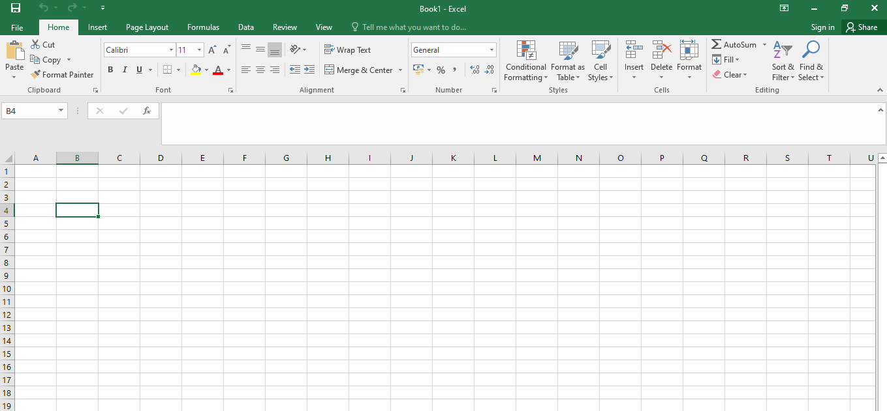
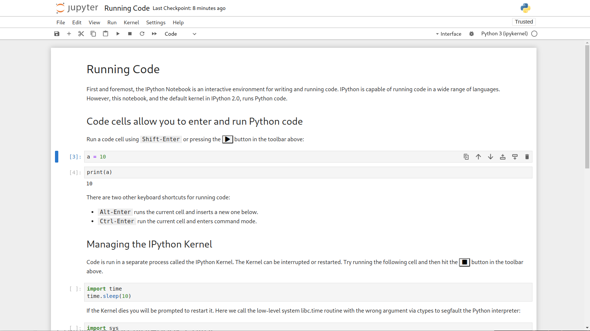

# 📊 Lesson 5: Overview of Industry Tools and Technologies

## Overview

**Duration**: 1 hour
**Date**: May 24, 2025
 

---

## 🎯 Learning Objectives

- 🧰 Understand the range of tools and technologies used in modern data analysis
- 🎯 Identify appropriate tools for different data analysis tasks and scenarios
- ⚖️ Recognize the advantages and limitations of various data analysis platforms
- 👁️ Gain familiarity with how common data analysis tools look and function

---

## 1. 🛠️ Common Tools in Data Analysis

Data analysis tools range from accessible everyday applications to specialized professional software. The right tool depends on the complexity of your data, your technical expertise, and your specific analytical needs.

### Spreadsheets

Spreadsheets are often the entry point for data analysis, providing accessibility and versatility for many common tasks.

**Microsoft Excel**

**Key Features:**

- Familiar grid-based interface
- Formula-based calculations
- Pivot tables for data summarization
- Conditional formatting for visual analysis
- Charts and basic visualizations
- Power Query for data transformation
- Power Pivot for data modeling

**Strengths:**

- Ubiquitous in business environments
- Low barrier to entry
- Quick for ad-hoc analysis
- Strong integration with Microsoft ecosystem

**Limitations:**

- Limited to ~1 million rows
- Performance issues with large datasets
- Limited reproducibility and automation
- Version control challenges

**Google Sheets**

**Key Features:**

- Similar functionality to Excel
- Cloud-native with real-time collaboration
- Version history tracking
- Integration with Google services
- Connected sheets for BigQuery data

**Strengths:**

- Excellent collaboration capabilities
- Accessible from any device with internet
- Easy sharing and publishing
- Free for basic use

**Limitations:**

- More limited than Excel for advanced features
- Less powerful for very large datasets
- Requires internet connection for full functionality

> **When to use spreadsheets**: Best for quick analyses, smaller datasets (under 100,000 rows), ad-hoc calculations, and when working with non-technical stakeholders.

### Programming Languages

Programming languages offer greater power, flexibility, and reproducibility than spreadsheets, especially for complex or large-scale analyses.

**Python**

**Key Libraries:**

- **Pandas**: Data manipulation and analysis
- **NumPy**: Numerical computing
- **Matplotlib/Seaborn**: Data visualization
- **Scikit-learn**: Machine learning
- **SciPy**: Scientific computing
- **Jupyter**: Interactive notebooks

**Strengths:**

- Versatile general-purpose language
- Extensive ecosystem of data libraries
- Strong for machine learning applications
- Great visualization capabilities
- Active community and documentation
- Free and open-source

**Limitations:**

- Steeper learning curve than spreadsheets
- Can be slower than R for some statistical operations
- Package dependencies can be challenging

**R**

**Key Features:**

- **tidyverse**: Collection of packages for data science
- **ggplot2**: Elegant data visualizations
- **dplyr**: Data manipulation
- **shiny**: Interactive web applications
- **caret**: Machine learning workflows
- **RStudio**: Integrated development environment

**Strengths:**

- Designed specifically for statistics and data analysis
- Exceptional for statistical modeling
- Publication-quality visualizations
- Strong in academic and research communities
- Free and open-source

**Limitations:**

- Steeper learning curve than spreadsheets
- Syntax can be inconsistent
- Memory management issues with very large datasets

> **When to use programming languages**: Best for complex analyses, large datasets, reproducible research, automated workflows, and advanced statistical modeling or machine learning.

### Databases and Querying Languages

Databases provide structured storage and efficient retrieval of large volumes of data, with SQL (Structured Query Language) as the standard language for interacting with relational databases.

**SQL**

**Common Implementations:**

- **MySQL**: Open-source, widely used
- **PostgreSQL**: Advanced open-source option
- **Microsoft SQL Server**: Enterprise solution
- **SQLite**: Lightweight, embedded database
- **Oracle**: Enterprise-grade database system

**Key SQL Operations:**

- SELECT: Retrieve data
- JOIN: Combine tables
- WHERE: Filter records
- GROUP BY: Aggregate data
- ORDER BY: Sort results
- INSERT, UPDATE, DELETE: Modify data

**Strengths:**

- Industry standard for data querying
- Designed for handling relational data
- Optimized for large dataset operations
- Consistent across most database systems
- Precise data retrieval

**Limitations:**

- Limited statistical functionality
- Less suitable for unstructured data
- Requires database setup and maintenance
- Less intuitive for beginners than spreadsheets

**NoSQL Databases**

**Types and Examples:**

- **Document stores**: MongoDB, Couchbase
- **Key-value stores**: Redis, DynamoDB
- **Column-family stores**: Cassandra, HBase
- **Graph databases**: Neo4j, Amazon Neptune

**When to use NoSQL:**

- Working with unstructured or semi-structured data
- Need for horizontal scaling
- Flexible schema requirements
- High-volume, high-velocity data

> **When to use databases**: Best for working with very large datasets, multi-user environments, data that requires structured storage and relationships, and when data integrity and security are paramount.

### Data Visualization Tools

Data visualization tools help transform complex data into intuitive visual formats, making insights more accessible to technical and non-technical audiences alike.

**Tableau**

**Key Features:**

- Drag-and-drop interface
- Wide range of visualization types
- Interactive dashboards
- Data connections to many sources
- Mapping capabilities
- Mobile-friendly designs
- Tableau Public for free sharing

**Strengths:**

- Intuitive visual interface
- Rapid dashboard creation
- Excellent interactive capabilities
- Strong community and learning resources

**Limitations:**

- Cost can be high for professional version
- Limited statistical analysis capabilities
- Less customization than programming tools

**Microsoft Power BI**

**Key Features:**

- Similar drag-and-drop functionality to Tableau
- Power Query for data preparation
- DAX language for custom calculations
- Strong integration with Microsoft products
- AI-powered insights
- Embedded analytics options

**Strengths:**

- Cost-effective compared to other BI tools
- Familiar to users of Microsoft products
- Monthly updates with new features
- Free Desktop version available

**Limitations:**

- More limited than Tableau in some visualization aspects
- Best performance in Microsoft ecosystem
- Some advanced features only in premium version

**Other Notable Visualization Tools:**

- **Looker**: Google's enterprise BI platform
- **QuickSight**: Amazon's cloud-based BI service
- **Grafana**: Open-source platform for time-series data
- **Datawrapper**: Simple tool for creating charts
- **Flourish**: Template-based interactive visualizations

> **When to use visualization tools**: Best for creating interactive dashboards, presenting data to stakeholders, exploring data visually, and when you need polished visualizations without extensive coding.

---

## 2. ☁️ Cloud Tools and Collaboration Platforms

Modern data analysis increasingly relies on cloud-based tools that offer scalability, accessibility, and collaboration features beyond traditional desktop applications.

### Cloud Data Platforms

**Google Cloud Platform (GCP)**

**Key Data Services:**

- **BigQuery**: Serverless data warehouse
- **Dataflow**: Stream and batch processing
- **Looker**: Business intelligence
- **Vertex AI**: Machine learning platform
- **Data Studio**: Reporting and dashboards

**Microsoft Azure**

**Key Data Services:**

- **Azure Synapse Analytics**: Analytics service
- **Azure Data Lake**: Storage for big data
- **Azure Databricks**: Apache Spark-based analytics
- **Power BI**: Business intelligence
- **Azure Machine Learning**: ML service

**Amazon Web Services (AWS)**

**Key Data Services:**

- **Redshift**: Data warehouse
- **S3**: Object storage
- **EMR**: Big data platform
- **SageMaker**: Machine learning platform
- **QuickSight**: Business intelligence

**Benefits of Cloud Platforms:**

- Scalable resources on demand
- No hardware to maintain
- Pay-as-you-go pricing models
- Built-in security and compliance features
- Integrated services for end-to-end workflows
- Global accessibility

### Collaboration Tools for Data Teams

**Version Control Systems**

**GitHub/GitLab**

- Code and notebook version control
- Collaborative review process
- Issue tracking
- Project management features
- Documentation hosting

**Notebook Environments**

**Jupyter Hub**

- Multi-user notebook environment
- Shareable interactive documents
- Supports multiple programming languages
- Can run in cloud environments

**Google Colab**

- Free cloud-based notebook environment
- GPU and TPU access
- Easy sharing and collaboration
- Integration with Google Drive

**Project Management Tools**

**Jira/Trello/Asana**

- Task tracking and assignment
- Project timelines and milestones
- Integration with data and development tools
- Progress reporting

**Communication Platforms**

**Slack/Microsoft Teams**

- Channel-based communication
- File sharing
- Integration with data tools and alerts
- Video meetings and screen sharing

### Data Sharing and Documentation

**Data Catalogs**

- **Alation**: Enterprise data catalog
- **Collibra**: Data intelligence platform
- **Microsoft Purview**: Data governance service
- **Google Data Catalog**: Metadata management

**Documentation Tools**

- **Confluence**: Wiki and knowledge base
- **Notion**: All-in-one workspace
- **Dataedo**: Database documentation tool

> **Collaboration Best Practices**: Effective data teams typically implement a combination of version control for code, project management for task tracking, communication tools for discussions, and proper documentation for knowledge sharing.

---

## 3. 📊 Brief Overview of Tool Usage

### Practical Use Cases by Tool Type

| Tool Type               | Beginner Use Case                           | Intermediate Use Case                        | Advanced Use Case                                           |
| ----------------------- | ------------------------------------------- | -------------------------------------------- | ----------------------------------------------------------- |
| **Spreadsheets**  | Monthly budget tracking with basic formulas | Sales analysis with pivot tables and charts  | Automated reporting with macros and Power Query             |
| **Python/R**      | Data cleaning and simple visualizations     | Statistical analysis and predictive modeling | Machine learning pipelines and automated workflows          |
| **SQL**           | Basic queries to retrieve and filter data   | Complex joins across multiple tables         | Optimized queries and stored procedures for large databases |
| **Visualization** | Standard charts and dashboards              | Interactive multi-view dashboards            | Custom visualizations with advanced interactivity           |
| **Cloud Tools**   | Using pre-built templates and services      | Custom workflows combining multiple services | Enterprise-scale data architecture design                   |

### Tool Selection Framework

**🔍 Key Question:** Which tool is best suited for your specific data analysis task?

When deciding which tool to use for a data analysis task, consider these factors:

| Factor                             | Considerations                                                                                                                                        | Tool Recommendations                                                                                                                                                                                                                                     |
| ---------------------------------- | ----------------------------------------------------------------------------------------------------------------------------------------------------- | -------------------------------------------------------------------------------------------------------------------------------------------------------------------------------------------------------------------------------------------------------- |
| **📊 Data Volume**           | • Small: Fits in memory (<100K rows) <br> • Medium: Requires optimization (100K-10M rows) <br> • Large: Distributed systems needed (>10M rows) | •**Small:** Spreadsheets, R/Python <br> • **Medium:** SQL databases, optimized Python/R <br> • **Large:** Cloud platforms, Spark, big data tools                                                                                |
| **🧮 Analysis Complexity**   | • Basic: Sums, averages, filters <br> • Intermediate: Statistical tests, regressions <br> • Advanced: Machine learning, network analysis       | •**Basic:** Spreadsheets, SQL <br> • **Intermediate:** R, Python, specialized statistics software <br> • **Advanced:** Python, R, specialized ML platforms                                                                      |
| **👁️ Output Requirements** | • Static reports or tables <br> • Interactive dashboards <br> • Automated systems/pipelines <br> • Embedded analytics in applications       | •**Static:** Any tool with export capabilities <br> • **Interactive:** Tableau, Power BI, Shiny, Dash <br> • **Automated:** Python/R with scheduling, cloud services <br> • **Embedded:** BI platforms with API access |
| **👥 User Expertise**        | • Beginner: No programming experience <br> • Intermediate: Some technical skills <br> • Advanced: Comfortable with coding and algorithms       | •**Beginner:** Spreadsheets, BI tools with GUIs <br> • **Intermediate:** SQL, basic Python/R <br> • **Advanced:** Advanced Python/R, specialized tools                                                                          |
| **🤝 Collaboration Needs**   | • Solo project <br> • Small team collaboration <br> • Enterprise with multiple stakeholders <br> • Public sharing requirements              | •**Solo:** Any tool <br> • **Small team:** Cloud tools, version control <br> • **Enterprise:** Platforms with access control <br> • **Public:** Tools with sharing capabilities                                        |

#### ✅ When to use Spreadsheets

- Quick ad-hoc analysis needed
- Small to medium datasets
- Non-technical audience
- Simple calculations and charts
- One-time or infrequent analysis

#### ✅ When to use Python/R

- Reproducible analysis required
- Complex statistical methods needed
- Automation is important
- Data processing pipelines
- Machine learning applications

#### ✅ When to use SQL/Databases

- Working with relational data
- Large structured datasets
- Multi-user access needed
- Data integrity is critical
- Combining data from multiple sources

#### ✅ When to use BI Tools

- Interactive dashboards needed
- Visualizations for non-technical users
- Regular reporting requirements
- Business metrics monitoring
- Self-service analytics environment

> **💡 Remember:** The best tool is often the one you know well. For many analyses, using a familiar tool efficiently is better than struggling with a theoretically more powerful but unfamiliar one.

---

## 4. 🖥️ Tool Demo: How Data Analysis Tools Look and Function

### Spreadsheet Analysis (Microsoft Excel)

**What you would see in a live demo:**

In an Excel demonstration, you would see a spreadsheet with data arranged in rows and columns. The instructor would demonstrate:

1. **Data organization**: How data is structured in a table format with headers
2. **Basic formulas**: Simple calculations like SUM, AVERAGE, and COUNT
3. **Filtering and sorting**: How to isolate specific data points
4. **Pivot tables**: Summarizing data by different dimensions
5. **Charts**: Creating visual representations of the data
6. **Conditional formatting**: Highlighting patterns with color coding

**Example scenario**: Analyzing sales data to identify top-performing products and regions.



**Key Excel shortcuts and techniques:**

- CTRL+T to create formatted tables
- ALT+= to quickly sum a range
- CTRL+SHIFT+↓ to select data to the last row
- F11 to instantly create a chart
- Quick Analysis tool (CTRL+Q) for instant visualizations

### Programming with Python

**What you would see in a live demo:**

In a Python demonstration, you would see the instructor using a Jupyter Notebook, showing how code and output appear together in an interactive document. Key elements would include:

1. **Importing libraries**: Loading pandas, matplotlib, and other essential packages
2. **Loading data**: Reading CSV files into DataFrame structures
3. **Data exploration**: Viewing and summarizing data
4. **Data manipulation**: Filtering, grouping, and transforming data
5. **Visualization**: Creating plots to understand patterns
6. **Analysis insights**: Interpreting the results

**Example code snippet for basic data analysis:**

```python
# Import libraries
import pandas as pd
import matplotlib.pyplot as plt
import seaborn as sns

# Load data
sales_data = pd.read_csv('sales_data.csv')

# View the first few rows
print(sales_data.head())

# Get summary statistics
print(sales_data.describe())

# Group data by region and product
region_product_sales = sales_data.groupby(['Region', 'Product'])['Sales'].sum().reset_index()

# Create a visualization
plt.figure(figsize=(10, 6))
sns.barplot(x='Region', y='Sales', hue='Product', data=region_product_sales)
plt.title('Sales by Region and Product')
plt.xticks(rotation=45)
plt.tight_layout()
plt.show()

# Find top-selling products
top_products = sales_data.groupby('Product')['Sales'].sum().sort_values(descending=True)
print("Top 5 Products:")
print(top_products.head(5))
```



**Key Python data analysis concepts:**

- DataFrames as the primary data structure
- Method chaining for efficient operations
- Vectorized operations instead of loops
- Integration of analysis and visualization
- Documentation with markdown cells

### Database Querying with SQL

**What you would see in a live demo:**

In an SQL demonstration, you would see a query editor interface where the instructor writes commands to retrieve and manipulate data. The demonstration would show:

1. **Database connection**: Connecting to a sample database
2. **Basic queries**: Selecting data from tables
3. **Filtering**: Using WHERE clauses to find specific records
4. **Joining tables**: Combining data from multiple sources
5. **Aggregation**: Summarizing data with GROUP BY
6. **Result viewing**: How results are displayed in tabular format

**Example SQL queries:**

```sql
-- Basic query to retrieve all sales data
SELECT * FROM sales_data LIMIT 10;

-- Filtering for a specific region
SELECT * FROM sales_data WHERE region = 'Northeast';

-- Joining sales data with product information
SELECT s.date, s.region, p.product_name, s.units_sold, s.revenue
FROM sales_data s
JOIN products p ON s.product_id = p.id;

-- Aggregating sales by region
SELECT region, SUM(revenue) as total_revenue
FROM sales_data
GROUP BY region
ORDER BY total_revenue DESC;
```

### Visualization with Tableau/Power BI

**What you would see in a live demo:**

In a visualization tool demonstration, you would see the instructor using a drag-and-drop interface to create interactive dashboards. Key elements would include:

1. **Data connection**: Importing data from various sources
2. **Field selection**: Choosing dimensions and measures
3. **Visualization creation**: Dragging fields to create charts
4. **Dashboard assembly**: Combining multiple visualizations
5. **Interactivity**: Adding filters and drill-down capabilities
6. **Publishing**: Sharing the finished dashboard

**Example dashboard elements:**

- Sales trend line chart by month
- Regional sales map
- Product category breakdown
- KPI cards showing summary metrics
- Interactive filters for time period and product

---

## 📝 Activity: Tool Demonstration

### Instructor-Led Tool Comparison (30 minutes)

During this activity, the instructor will provide a live demonstration of Excel and Python to show how the same data analysis task can be accomplished using different tools.

#### Analysis Setup

**Dataset:**

- Retail sales data containing transaction records with:
  - Date
  - Store location
  - Product category
  - Sales amount
  - Units sold
  - Customer demographics

**Analysis Goal:** Identify sales trends by product category and region, and determine which factors most influence sales performance.

#### 📊 Excel Demonstration (15 minutes)

1. Data import and organization
2. Creating a pivot table to summarize sales by category and region
3. Adding calculated fields for average transaction value
4. Creating visualizations (bar chart, line chart)
5. Using filtering to focus on specific time periods
6. Exporting results for sharing


#### 🐍 Python Demonstration (15 minutes)

1. Loading data with pandas
2. Data cleaning and preparation
3. Exploratory analysis with groupby operations
4. Statistical analysis to identify correlations
5. Creating visualizations with matplotlib and seaborn
6. Exporting results to various formats


**Key Comparison Points:**

- Ease of use for different operations
- Time required for similar tasks
- Flexibility and customization options
- Reproducibility of the analysis
- Handling of larger data volumes
- Documentation capabilities

---

## 📚 Additional Resources

### Learning Resources by Tool Category

#### 📊 Excel and Spreadsheets

- [Microsoft Excel Tutorial](https://support.microsoft.com/en-us/excel)
- [Excel for Data Analysis (Coursera)](https://www.coursera.org/learn/excel-data-analysis)
- [Google Sheets Training and Help](https://support.google.com/a/users/answer/9282959)
- [ExcelJet Formula Database](https://exceljet.net/formulas)

#### 🐍 Python

- [Python for Data Science Handbook](https://jakevdp.github.io/PythonDataScienceHandbook/)
- [Codecademy Python Course](https://www.codecademy.com/learn/learn-python-3)
- [DataCamp Python for Data Science](https://www.datacamp.com/tracks/python-programmer)
- [Pandas 10-Minute Tutorial](https://pandas.pydata.org/docs/user_guide/10min.html)

#### 🗄️ SQL

- [W3Schools SQL Tutorial](https://www.w3schools.com/sql/)
- [Mode SQL Tutorial](https://mode.com/sql-tutorial/)
- [SQL for Data Analysis (Udacity)](https://www.udacity.com/course/sql-for-data-analysis--ud198)
- [SQLBolt Interactive Lessons](https://sqlbolt.com/)

#### 📈 Visualization Tools

- [Tableau Public](https://public.tableau.com/)
- [Microsoft Power BI Learning](https://powerbi.microsoft.com/en-us/learning/)
- [Data Visualization Society](https://www.datavisualizationsociety.com/resources)
- [D3.js Examples Gallery](https://d3js.org/examples)

### Free Tool Options

| Category                | Free Options                                                                                                             | Best For                                                                              |
| ----------------------- | ------------------------------------------------------------------------------------------------------------------------ | ------------------------------------------------------------------------------------- |
| **Spreadsheets**  | • Google Sheets <br> • LibreOffice Calc <br> • Microsoft Excel Online                                             | Quick analyses, simple visualizations, collaborative editing, data organization       |
| **Programming**   | • Python with Anaconda distribution <br> • R with RStudio Desktop <br> • Google Colab <br> • Jupyter Notebooks | Advanced analytics, automation, custom visualizations, reproducible research          |
| **Databases**     | • SQLite <br> • MySQL Community Edition <br> • PostgreSQL <br> • DuckDB                                        | Structured data storage, multi-table relationships, data integrity, multi-user access |
| **Visualization** | • Tableau Public <br> • Power BI Desktop <br> • Google Data Studio <br> • Flourish                             | Interactive dashboards, shareable visualizations, data storytelling                   |

#### 🔗 Course Resource Repository

Access example datasets, additional tutorials, and reference materials at:

[Course GitHub Repository](https://github.com/datalearning/resources)

---

## 📋 Homework Assignment

**Due:** Before the next class session

### Tool Exploration Task

#### 📋 Instructions:

1. Choose **one tool from each category** discussed today:

   - Spreadsheet tool (Excel, Google Sheets, etc.)
   - Programming language/environment (Python, R, etc.)
   - Database/SQL platform (MySQL, PostgreSQL, SQLite, etc.)
2. For each chosen tool:

   - Find and review at least one tutorial or getting started guide
   - List 3-5 key features that would be useful for data analysis
   - Identify what types of analysis tasks it seems best suited for
3. If possible, download and install one of the free tools mentioned and complete a simple "Hello World" equivalent task (e.g., import data, create a basic chart)
4. Write a brief reflection (1 paragraph) on which tool you found most interesting and why

### Submission Format

Please organize your homework using the following template:

```
# Tool Exploration Assignment

## Spreadsheet Tool: [Name]
- Tutorial/resource reviewed: [URL or title]
- Key features:
  1.
  2.
  3.
- Best suited for:

## Programming Tool: [Name]
- Tutorial/resource reviewed: [URL or title]
- Key features:
  1.
  2.
  3.
- Best suited for:

## Database Tool: [Name]
- Tutorial/resource reviewed: [URL or title]
- Key features:
  1.
  2.
  3.
- Best suited for:

## Visualization Tool: [Name]
- Tutorial/resource reviewed: [URL or title]
- Key features:
  1.
  2.
  3.
- Best suited for:

## Hands-on Experience
Tool I tried: [Name]
What I did: [Brief description]
Screenshot: [If applicable]

## Reflection
[Your paragraph about which tool was most interesting and why]
```

**💡 Pro Tip:** Focus on exploring tools that might be relevant to your current work or study interests. This will make the assignment more valuable for your personal development.

---

*Next Lesson: Practical Data Analysis Project* ⏭️

**✓ Lesson 5 Complete - 5 of 6 ✓**
